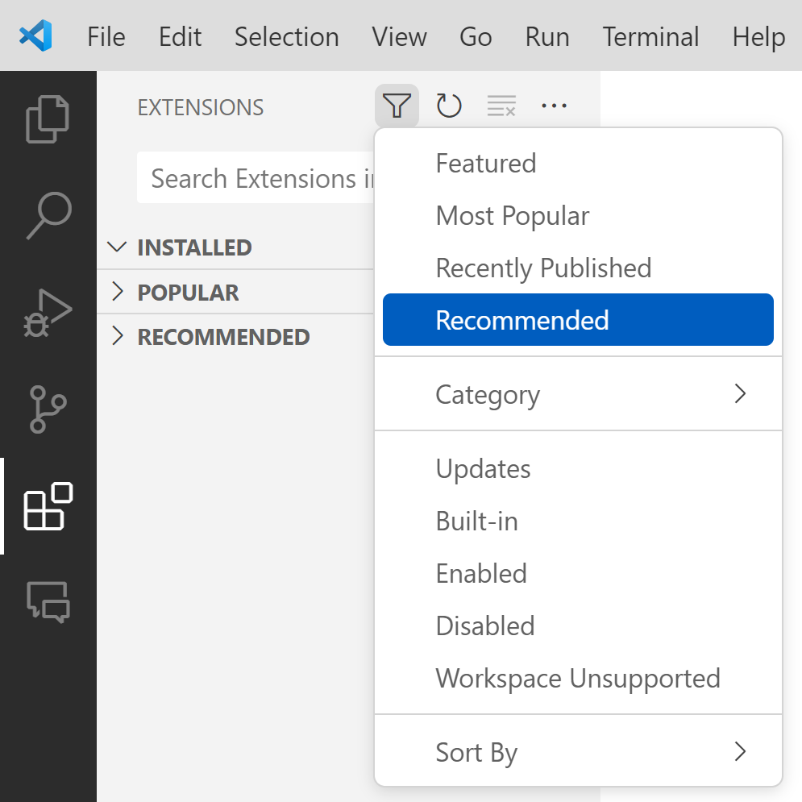

# GitDoc Usage

> **Your Name Here**

> Use this repository as a test that you have the correct settings in [Visual Studio Code](https://code.visualstudio.com/) for using [GitDoc](https://aka.ms/gitdoc) in your school projects.

Follow the instructions below to ensure that you have Visual Studio Code correctly set up for this repository. If you have any problems, please see the [pre-requisites/trouble-shooting](#pre-requisitestrouble-shooting) section below.

When you think you have GitDoc set up, try putting your name in the area indicated above. You should see

- VS Code auto-save your file, and
- auto-commit the changes with a time stamp (possibly after a short delay, depending on the settings), and finally
- auto-push your changes to GitHub (also possibly after a short delay, on the order of seconds to minutes depending on the settings)

Keep making changes to this repository. Add files, edit files, etc. All your work will be recorded, and there will be a clear demonstration of the efforts you have put into your project/assignment.

----

## Automatic Commits

**NOTE:** VS Code AutoSave and GitDoc have been enabled for this repository; ***do not turn this off***. Check your settings to ensure that you have *GitDoc* as well as *AutoSave* for VS Code enabled for this lab.

> *Your instructor will notify you if any changes or additions are required to these settings (such as having a delay on commits to allow GitHub actions to complete).*

This repository is set up with **recommended extensions**. When you open it in Visual Studio Code, you should be prompted to install these extensions. To manually check what is installed, see the Extensions panel in VS Code and filter for "Recommended".



To manually turn on AutoSave for VS Code, check your settings for the text `AutoSave` and be sure that they have been correctly applied to your *Workspace* settings.

| File -> Settings                   | AutoSave                                    |
| ---------------------------------- | ------------------------------------------- |
|  |  |

### Manual Configuration

To manually enable GitDoc, press <kbd>F1</kbd>, type `GitDoc: Enable` and press <kbd>Enter</kbd>.


> **Note:** If you do *not* see `GitDoc` in the list of options, you may need to install the extension. Press <kbd>F1</kbd>, type `Extensions: Install Extensions` and press <kbd>Enter</kbd>. Search for `GitDoc` and install it.

Also make sure that you have set the Commit Validation Level to `none` in your workspace settings.

| File -> Settings                   | Commit Validation Level                         |
| ---------------------------------- | ----------------------------------------------- |
|  |  |

### Pre-requisites/Trouble-Shooting

> If you have any problems with GitDoc performing the commits, even after it is enabled, try toggling the `GitDoc: Enable` command off and on again. If that doesn't work, try restarting VS Code. If that doesn't work, try performing a manual commit, followed by a manual push (it may need to be a force push - `git push -f`) and finally toggle the `GitDoc: Enable` off and on again.

Ensure that git knows your username and email. You can find out if it is configured on your computer by running the following commands in the terminal.

```ps
git config --global user.name
git config --global user.email
```

If there is no information on your user name or email in the git configuration, run the following code, replacing the username and email information with your personal information.

```ps
git config --global user.name "Your Full Name"
git config --global user.email "YourSchoolEmail@nait.ca"
```

----
